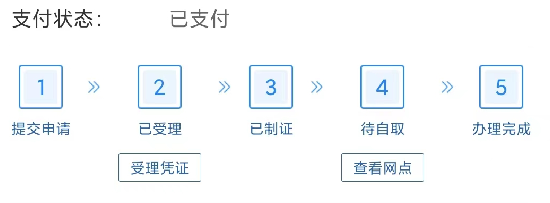

**驾驶本到期换新要想照片拍的好看，办理不耽误时间请按照以下步骤进行**

1. 去医院进行体检，费用20元。体检项目：视力、色盲测试、五指健全拍照。
2. 视力体检注意项，如轻微近视也需要进行佩戴眼镜。没有眼镜可以考虑去附近眼镜店进行测试视力并租用眼镜。租用30元。
3. 通过手机12123手机APP进行申请换证，通过手机拍照，并选择邮寄。费用：邮寄20、换本费用10。总计30元。
4. 如果自取请注意工作时间：上午8:30-12:00 下午14:30-5:30 周六日不上班，没有自取设备。需要自带两张一寸照片，如果没有办理地点也有拍摄照片服务，需要付费。
5. 选择网点自取，请携带本人身份证于七个工作日内到网点自取，逾期将拉入黑名单。

- 1选择邮寄直接使用手机采集的照片
- 2选择自己打印照片

**建议：直接选择去医院进行体检，并选择邮寄，总费用20+30+30=80元。不然你就只能请假办理，蛋疼的一逼。**

**这是最省时间的办理方式，千万别自取~~~~~~~~~~~~~~~~~~**

 

 

**注意：第一天提示你可以去领证以后，第二天他们就会自动点击完成。**

**如果你提交的日期是非工作日，会在当天或者第二天进行退办并退款。不会将订单延迟到工作日再进行办理。**

**他们可以提前选择完成订单，但是你不可以超过七个工作日内到网点自取，逾期将拉入黑名单。**

**驾驶本电子化，并和身份证一体化有待提升！！！** 